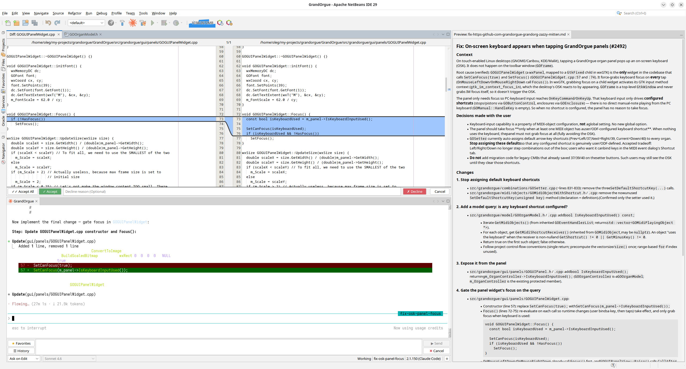

# NetBeans IDE AI Plugin — Full Swing UI Support for Claude, Devin, Windsurf, Cursor


[](https://github.com/nipunanirmal/NetbeansPlugin-IDE-Devin-ClaudeCode/releases/latest)
[](https://github.com/nipunanirmal/NetbeansPlugin-IDE-Devin-ClaudeCode/releases)



> **A fork expanded beyond the original scope** — while the upstream project focused only on Claude Code CLI, this version adds **full Devin CLI support**, **MCP server for Cursor/Windsurf**, and **complete Swing GUI form generation** via AI.
>
> **🎯 Key Feature: 100% Swing UI Creation** — This MCP can create fully functional NetBeans Swing forms (`.form` + `.java`) with proper GEN markers, color encoding, event handlers, and layouts that open correctly in the NetBeans GUI Designer on the first try.

NetBeans Claude Code GUI is a NetBeans IDE plugin that embeds an AI CLI (Claude Code **or Devin**) as a full interactive terminal session directly inside the IDE. You type prompts in a dedicated session tab, the AI reads and edits your project files, and the plugin provides:

- **Graphical file diff** — review every proposed file change before it is written to disk; accept, decline (with an optional reason), or interrupt Claude
- **Interactive choice menu** — Claude's Yes/No and multiple-choice prompts appear as a native panel instead of raw terminal text
- **Prompt history and favorites** — recall past prompts with Ctrl+Up/Down; save reusable prompts as favorites with optional keyboard shortcuts
- **File attachments** — attach files via `@path` tokens with auto-completion popup, drag-and-drop, and clipboard paste support
- **Multiple profiles** — run Claude Code under separate accounts or API keys for different projects, each with an isolated config directory, authentication, proxy, and model settings
- **OpenAI-compatible proxy** — route Claude Code through any OpenAI-compatible provider (OpenAI, Azure OpenAI, Groq, DeepSeek, Ollama, LM Studio, and others) via a built-in translation proxy; no changes to Claude Code CLI required
- **Session management** — start new sessions, continue the last session, or resume a specific past session; sessions persist across IDE restarts
- **Markdown Preview** — live-rendered markdown tab for plan files and MCP-initiated previews; includes a find bar (Ctrl+F) and font zoom (Alt+Scroll)
- **Auto Plan Preview** — when Claude writes a plan file, a live preview tab opens automatically as soon as you accept the diff
- **IDE integration via MCP** — open editors, diagnostics, current selection, and file operations are exposed to Claude via the MCP protocol so it always has full context about your work
- **NetBeans look & feel** — the plugin respects the active NetBeans color theme and font settings, including dark/light mode
- **Flexible UI customization** — per-session terminal font and zoom (Alt+Scroll), configurable diff viewer placement, adjustable session list limit, and keyboard shortcuts for favorite prompts

The plugin code was written entirely by [Claude Code](https://claude.ai/code) using **Claude Sonnet 4.6**, with the author acting as architect and reviewer.

---

## Download

Download the latest `.nbm` file from [GitHub Releases](https://github.com/nipunanirmal/NetbeansPlugin-IDE-Devin-ClaudeCode/releases/latest).

Intermediate builds between releases are available as artifacts on the [Actions](https://github.com/nipunanirmal/NetbeansPlugin-IDE-Devin-ClaudeCode/actions) page — open the latest successful workflow run and download the `nbm` artifact (delivered as a zip file; extract the `.nbm` before installing).

---

See [Installation & Build](docs/installation.md) for requirements, installation steps, and build instructions.

---

## Devin CLI Setup

> **This fork significantly expands capabilities beyond the original.** The upstream project only supports Claude Code CLI. This version supports **Claude Code, Devin, Windsurf, Cursor** and adds **AI-powered Swing GUI form generation**.

### 1. Install the plugin

Build from this fork and install the `.nbm` (see above), or build from source:

```
mvn clean package -DskipTests
```

Then install `target/nbm/netbeans-plugin-claude-code-gui-*.nbm` via **Tools → Plugins → Downloaded → Add Plugins…**

### 2. Switch to Devin CLI in settings

1. Open **Tools → Options → Claude Code → Advanced**
2. Set **CLI type** to **Devin (devin)**
3. Leave **CLI executable path** blank — the plugin auto-detects `devin` from your PATH
4. Click **OK** and restart if prompted

### 3. Register the NetBeans MCP server with Devin (once only)

Unlike Claude Code (which accepts `--mcp-config` at startup), Devin stores MCP servers persistently. Run this once in a terminal — replace the port if you changed it from the default:

```
devin mcp add netbeans http://127.0.0.1:28991/sse
```

Verify with `devin mcp list` — you should see `netbeans` listed.

### 4. Start a session

Click the **Devin** toolbar button (or open the session tab) — `devin` will launch in the embedded terminal with the MCP server already connected.

> **Note:** The MCP port (default `28991`) must match what the plugin is using. Check **Tools → Claude Code Status** to confirm the server is running and note the port.

---

## Usage

See the [User Manual](docs/user-manual.md) for full documentation of all plugin features.

---

## Use NetBeans as an MCP Server from Windsurf, Cursor, or VS Code

The plugin runs a full **HTTP/SSE MCP server** inside NetBeans (default port **28991**). Any MCP-capable IDE can connect to it — not just Claude Code CLI. This works independently of whether you use Claude Code or Devin in the embedded terminal.

**Devin (desktop app)** — run once in a terminal:

```
devin mcp add netbeans http://127.0.0.1:28991/sse
```

**Windsurf** — add to `~/.codeium/windsurf/mcp_config.json`:

```json
{
  "mcpServers": {
    "netbeans": {
      "serverUrl": "http://localhost:28991/sse"
    }
  }
}
```

**Cursor** — add to `~/.cursor/mcp.json`:

```json
{
  "mcpServers": {
    "netbeans": {
      "url": "http://localhost:28991/sse"
    }
  }
}
```

**VS Code** (1.99+ native MCP, or `.vscode/mcp.json` in workspace):

```json
{
  "servers": {
    "netbeans": {
      "type": "sse",
      "url": "http://localhost:28991/sse"
    }
  }
}
```

After connecting, the AI in your IDE can call NetBeans tools: `getWorkspaceFolders`, `getOpenEditors`, `getCurrentSelection`, `getDiagnostics`, `openFile`, `saveDocument`, `permission_prompt`, `show_markdown`, and more.

Verify the server is running: `http://localhost:28991/status`

See [docs/windsurf-cursor-vscode.md](docs/windsurf-cursor-vscode.md) for full setup instructions.

---

## Windsurf Skill — Better AI Results with NetBeans GUI Forms

When you ask Windsurf to create NetBeans JFrame forms via MCP, importing the bundled **skill file** gives the AI precise knowledge of the `.form` XML format, color encoding rules, layout templates, and component properties — resulting in forms that open correctly in the NetBeans GUI Designer on the first attempt.

### How to import the skill

1. Copy [`docs/netbeans-form-color-format.md`](docs/netbeans-form-color-format.md) to your Windsurf skills folder:

```
%USERPROFILE%\.codeium\windsurf\skills\netbeans\SKILL.md       (Windows)
~/.codeium/windsurf/skills/netbeans/SKILL.md                    (macOS / Linux)
```

2. Restart Windsurf (or open **Cascade → Skills** and click **Refresh**).
3. The skill named **`netbeans`** will appear in the Skills panel as **Global**.

Once active, Windsurf will automatically apply the skill whenever you ask it to create NetBeans GUI forms, JFrames, or work with `.form` files — no extra prompt needed.

> **Why it matters:** NetBeans' `.form` XML has several non-obvious requirements — color values must be hex strings (not decimal), `GEN-BEGIN/END` markers are required for the Design tab, and `.form` files must be in the `views/` package to appear in the Projects panel. The skill encodes all of these rules so the AI gets them right every time.

---

## Third-party code

The MCP server integration (package `org.openbeans.claude.netbeans`) is based on
[claude-code-netbeans](https://github.com/emilianbold/claude-code-netbeans)
by Emilian Marius Bold, used under the **ISC License**:

> Copyright (c) 2025 Emilian Marius Bold
>
> Permission to use, copy, modify, and distribute this software for any purpose
> with or without fee is hereby granted, provided that the above copyright notice
> and this permission notice appear in all copies.
>
> THE SOFTWARE IS PROVIDED "AS IS" AND THE AUTHOR DISCLAIMS ALL WARRANTIES WITH
> REGARD TO THIS SOFTWARE INCLUDING ALL IMPLIED WARRANTIES OF MERCHANTABILITY AND
> FITNESS. IN NO EVENT SHALL THE AUTHOR BE LIABLE FOR ANY SPECIAL, DIRECT,
> INDIRECT, OR CONSEQUENTIAL DAMAGES OR ANY DAMAGES WHATSOEVER RESULTING FROM
> LOSS OF USE, DATA OR PROFITS, WHETHER IN AN ACTION OF CONTRACT, NEGLIGENCE OR
> OTHER TORTIOUS ACTION, ARISING OUT OF OR IN CONNECTION WITH THE USE OR
> PERFORMANCE OF THIS SOFTWARE.

**Changes made:** updated target NetBeans version from RELEASE190 to RELEASE230;
integrated into the `netbeans-claude-code-gui` plugin build alongside the PTY terminal component.

---

## License

[Apache License 2.0](LICENSE)
